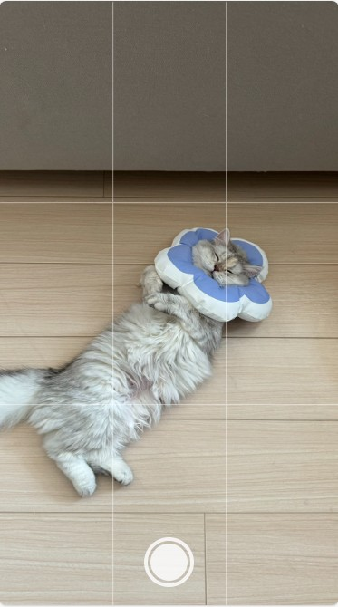

# vue3-native-camera



Vue 3 Native Camera is a Vue.js 3 plugin that allows you to access the native camera functionality on devices such as iPhones and capture photos. The captured photos can be obtained in base64 format.

## Installation

Install the package using npm:

```bash
npm install vue3-native-camera
```

## Usage

1. Import the `vue3-native-camera` plugin in your Vue 3 component:

```ts
import Vue3NativeCamera from 'vue3-native-camera';
```

2. Register the plugin:

```ts
createApp(App)
  .use(Vue3NativeCamera)
  .mount('#app');
```

3. Use the `vue3-native-camera` component in your template:

```html
<script setup lang="ts">

const camera = ref<InstanceType<typeof Vue3NativeCamera>>()

const open = () => {
    camera.value?.open()
}

const onSnapshot = (base64: string) => {
    console.log(base64)
}

</script>

<template>
  <div>
    <vue3-native-camera ref="camera" @on-snapshot="onSnapshot"/>
  </div>
</template>
```

## Props

### `quality`

This is the compression ratio. Please specify a number in the range of 1 or less as a number type.
The default is 1.

## Expose

### `open`

You cannot automatically launch the native camera without user interaction. 
Therefore, make sure to trigger the open function in association with user actions.

## Emits

### `on-snapshot`

Emitted when a photo is successfully captured. The base64-encoded photo data is passed as an argument to the event handler.

```html
<vue3-native-camera @on-snapshot="onSnapshot"/>
```

## License

This project is licensed under the MIT License - see the [LICENSE](LICENSE) file for details.
